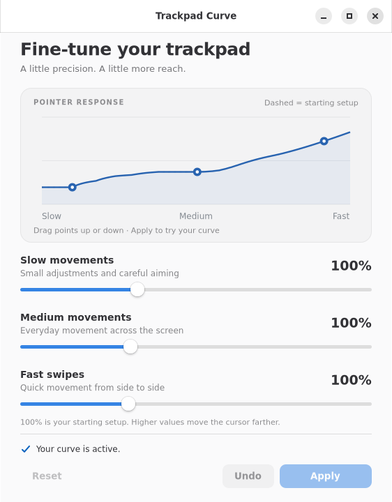

# Debian on the 12-inch MacBook

Simple setup guides and reversible fixes for the **2017 12-inch MacBook (`MacBook10,1`) running Debian 13 with GNOME**.

Get the speakers, Bluetooth and suspend working, add familiar Command-key shortcuts, and tune the trackpad with a small native app.

These fixes were developed and tested on that model. The 2015 (`MacBook8,1`) and 2016 (`MacBook9,1`) models are **not yet supported by these installers**. This repository is not for MacBook Air or MacBook Pro.

## Start here

1. Install [Debian 13 amd64](https://www.debian.org/releases/trixie/) and choose **GNOME**. See [fresh-install notes](docs/debian.md) for USB boot, networking and encryption.
2. Open Terminal on the MacBook. Update Debian, then reboot into its current kernel before building drivers:

   ```sh
   sudo apt update
   sudo apt full-upgrade
   sudo apt install git
   ```

   Save your work, then restart from GNOME's power menu.

3. Download this repository:

   ```sh
   git clone https://github.com/fanks/macbook12-linux.git
   cd macbook12-linux
   python3 scripts/check-system.py
   ```

4. Follow the guides for the features you want. Run their commands from this repository's folder.

| Feature | Guide | Activation |
| --- | --- | --- |
| Built-in speakers and volume | [Audio](docs/audio.md) | Shut down and power on |
| Bluetooth controller | [Bluetooth](docs/bluetooth.md) | Shut down and power on |
| Sleep and wake, including the lid | [Suspend](docs/suspend.md) | Reboot for the documented boot parameters |
| Cmd-X/C/V/N/T/W/Q and Cmd-Space | [Keyboard](docs/keyboard.md) | Reboot to refresh group membership |
| Precise slow movement, faster swipes | [Trackpad Curve](docs/trackpad.md) | Sign out and in once |

Each guide includes installation, a quick check and removal. Apply one feature at a time so you can tell what changed. The scripts do not reboot, log you out, suspend the machine or reload audio drivers automatically.

## Trackpad Curve

Drag a point or move a slider, then press **Apply**. Adjust slow aiming, everyday movement and fast swipes independently. **Undo** restores the previous change; **Reset** previews the starting curve.



[Install and use the app →](docs/trackpad.md)

## Compatibility and updates

- Hardware baseline: **MacBook10,1**, Cirrus CS4208 audio, Broadcom BCM4350C0 Bluetooth and Apple S3X NVMe.
- Audio and Bluetooth builds target Debian's **6.12 kernel series**, using the exact matching Debian source and headers. **Rebuild for each new kernel.** These scripts do not install DKMS or hold back security updates.
- Keyboard shortcuts require **GNOME Shell 48** and **keyd 2.5**.
- Custom trackpad support requires **GNOME Shell 48**, **Wayland** and **libinput 1.28.1**. It falls back to ordinary GNOME after an unsupported desktop/library upgrade.
- Hardware behavior was tested on an existing Debian installation. The reusable installers have isolated software/build tests; a complete clean-install run on a second machine has not yet been performed.

Read [maintenance and troubleshooting](docs/maintenance.md) before a kernel or desktop upgrade. Do not bypass a compatibility check to try another model; report the model and versions in an issue instead.

## Contributing

Reports from fresh installations are welcome. See [CONTRIBUTING.md](CONTRIBUTING.md) for checks and useful diagnostic information. Please exclude serial numbers, device addresses and private logs from public issues.

Original scripts and the trackpad app are MIT licensed. Driver sources are fetched from their upstream projects and retain their own licenses. See [LICENSE](LICENSE) and [NOTICE.md](NOTICE.md).
